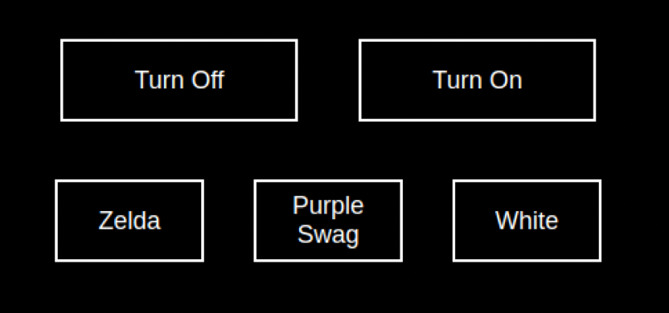

# Module : MMM-Hue-Controller

**This module allows you to control your Philips Hue Lights with simple buttons.**
- Turn On Button
- Turn Off Button
- Custom Themes Buttons



## Table of contents
- [Installing the module](#installing-the-module)
- [Prerequisites](#prerequisites)
  * [Gather the lights you want to control](#gather-the-lights-you-want-to-control)
  * [Using the module](#using-the-module)
- [Create a custom theme](#create-a-custom-theme)


## Installing the Module

Inside your modules folder, execute : 
> git clone https://github.com/gueguet/MMM-Hue-Controller  


### Prerequisites

This module will use the Philips Hue API : https://developers.meethue.com/  

You basically need three things to make the module working : 
- The IP address of your Philips Hue Bridge  
*You can get it with Angry IP Scanner to retrieve it for instance*
- An authorized username to use the API, follow instructions here : https://developers.meethue.com/develop/get-started-2/   
*This username is permanent so no need to refresh it or whatever*
- A list of integers that represents the lights you want to control   
*More info in the next point*


### Gather the lights you want to control

*This module is not for monitoring the status of all the lights in your home (if that's your purpose, check this cool module : https://github.com/michael5r/mmm-hue-lights)*  

To get all the lights available in your home, you can do a GET request on this endpoint :
><IP_OF_YOUR_HUE_BRIDGE>/api/<AUTHORIZED_USER>/lights

The response looks like : 
>{
>    1: {
>        "state": ...
>        "name": ...
>        ...
>    },
>    2: {
>        "state":...
>        "name"...
>        ...
>    },
>    ...
>}

Based on the response, indentify the lamps you want to monitor and keep their integers (keys of the JSON) in mind !


## Using the module

In the `config/config.js` file, just add this to the `modules` array :  
*To learn more about custom themes, please check the next point of this documentation*

```js
{
    module: "MMM-Hue-Controller",
    position: "top_right",
    config: {
        bridgeIp: "<IP_OF_YOUR_HUE_BRIDGE>",
        user: "<AUTHORIZED_USER>",
        lightsNumArray: ["<INT_LIGHT_1>","<INT_LIGHT_2"], // array of strings | keys of the targeted lights | example : ["2","5","6"]
        themeArray: [
            {
                "themeName": "Zelda", // will be the text content of the theme button
                "themeValue": {
                    "bri": 254, // bright
                    "hue": 40425, // hue
                    "sat": 196 // saturation
                }
            },
            {
                "themeName": "Purple Swag", // example of another custom theme
                "themeValue": {
                    "bri": 254,
                    "hue": 49361,
                    "sat": 178,
                }
            },
            {
                ...
            }
        ]
    }
},
```


## Create a custom theme

As you can see, you can add custom theme inside the themeArray. But the HSB (hue, bright, saturation) system can be a bit tricky, here is what I suggest to do :  
*Feel free to sugest me other methods to make this step easier !*  

You can use the official Hue app to choose the color you want to have in your scene, and then hit this endpoint to retrieve the HSB values :  
><IP_OF_YOUR_HUE_BRIDGE>/api/<AUTHORIZED_USER>/lights/<INT_OF_LIGHT>

In the response you will get something like this, just retrive the HSB values and paste it to the `config.js` files, as it's done in the provided examples.

```js
    {
        "state": {
            "on": false,
            "bri": 254, // bright
            "hue": 49361, // hue
            "sat": 178, // saturation
            "effect": "none",
            "xy": [
                0.2674,
                0.1684
            ],
            "ct": 153,
            "alert": "none",
            "colormode": "hs",
            "mode": "homeautomation",
            "reachable": true
        },
    }
```
